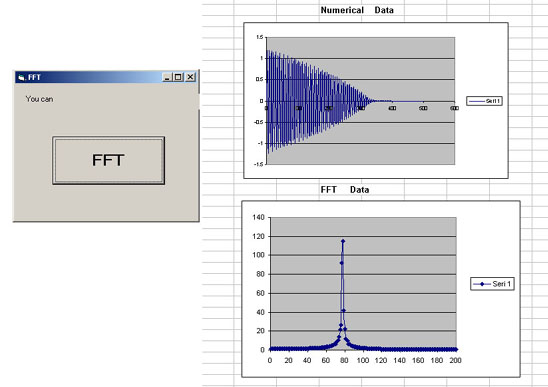



## Numerical FFT \(Fast Fourier Transform\)

### Description

FFT (fast fourier transform)
 
### More Info
 

             |
---                |---
**Submitted On**   |2007-04-06 17:43:30
**By**             |[Abdurrahim ](https://github.com/Planet-Source-Code/PSCIndex/blob/master/ByAuthor/abdurrahim.md)
**Level**          |Beginner
**User Rating**    |5.0 (10 globes from 2 users)
**Compatibility**  |VB 6\.0
**Category**       |[Files/ File Controls/ Input/ Output](https://github.com/Planet-Source-Code/PSCIndex/blob/master/ByCategory/files-file-controls-input-output__1-3.md)
**World**          |[Visual Basic](https://github.com/Planet-Source-Code/PSCIndex/blob/master/ByWorld/visual-basic.md)
**Archive File**   |[Numerical\_2059424102007\.zip](https://github.com/Planet-Source-Code/abdurrahim-numerical-fft-fast-fourier-transform__1-68324/archive/master.zip)

